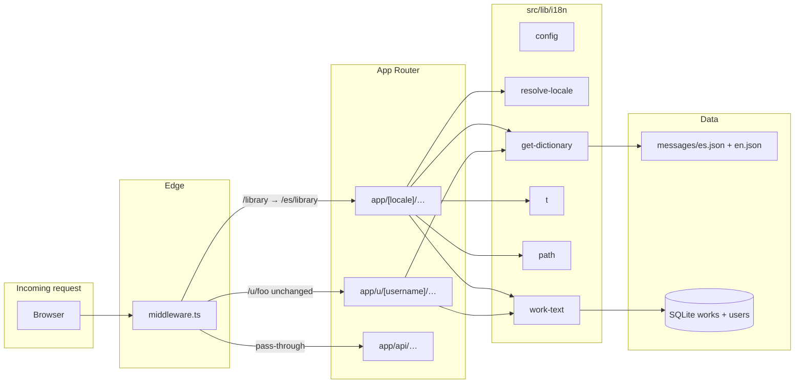

# Listae — URL locales + homegrown i18n

**Date:** 2026-07-27  
**Repo:** https://github.com/SirSoto25/listae  
**Status:** Approved (2026-07-27) — proceed to implementation plan  
**Related:** ADR 005 (profile HTML/CSS), ADR 010 (library domains), [2026-07-21-listae-design.md](./2026-07-21-listae-design.md)

## 1. Purpose

Add **Spanish and English** to the Listae app shell and catalog metadata without adopting `next-intl` yet. App routes live under `/{locale}`; public profiles stay at `/u/[username]` without a locale prefix. Work titles and synopses are stored in both languages at import time and displayed according to the visitor’s URL locale, with sensible fallbacks.

## 2. Decisions locked (brainstorming)

| Topic | Choice |
|-------|--------|
| App URL shape | Prefix `/{locale}` for all app routes (`es`, `en`) |
| Public profiles | `/u/[username]` and `/u/[username]/customize` — **no** locale prefix |
| Locales | `es` \| `en` |
| Default locale | `es` |
| Unprefixed app URLs | Middleware redirects using `Accept-Language` (prefer `es` or `en`); else `es` |
| i18n stack | Homegrown: middleware + `messages/*.json` + `src/lib/i18n/*` — **no** `next-intl` in MVP |
| Future migration | Same message key shape and route param name (`locale`) as `next-intl` would use |
| MVP UI scope | Site chrome (nav), login/onboarding, magic-link emails, profile **template labels** (status headings), catalog search + title pages |
| Work text | Store `titleEs` + `titleEn` and `synopsisEs` + `synopsisEn` at import; display by URL locale; fallback order: requested locale → `en` → legacy `title` / `synopsis` |
| Profile owner locale | `users.profileLocale` (`es` \| `en`, default `es`) controls **public profile chrome/labels** for that owner’s profile — **not** the visitor’s browser locale |
| Out of scope | Translating user custom HTML/CSS; additional locales; machine translation; actual `next-intl` migration |

## 3. Architecture



**Request flow (app routes):**

1. Request hits `/library` (no prefix) → middleware parses `Accept-Language`, picks `es` or `en`, **302** to `/{locale}/library`.
2. Request hits `/es/library` → middleware validates locale segment; Next.js renders `app/[locale]/library/page.tsx`.
3. Layout reads `params.locale`, sets `<html lang="es">`, loads dictionary via `getDictionary("es")`, passes `t` to server components.
4. `LocaleLink` / `localePath("/library")` keep links inside the active locale.
5. Request hits `/u/alice` → **no** middleware rewrite; page loads owner’s `profileLocale` dictionary for status labels; work titles use visitor-independent DB fields resolved by owner locale (see §8).

## 4. Stable i18n API (`src/lib/i18n/`)

These modules form the **public surface** for app code. Keep names and signatures stable so a future `next-intl` swap replaces internals only.

| File | Responsibility |
|------|----------------|
| `config.ts` | `LOCALES`, `Locale`, `DEFAULT_LOCALE`, `isLocale()`, `localeLabels` |
| `resolve-locale.ts` | `resolveLocaleFromPathname()`, `resolveLocaleFromAcceptLanguage()`, `negotiateLocale()` |
| `get-dictionary.ts` | `getDictionary(locale): Promise<Dictionary>` — static import of JSON |
| `t.ts` | `createTranslator(dict)`, `t(key, params?)`, dot-key lookup, `{name}` interpolation |
| `path.ts` | `stripLocalePrefix()`, `localePath(locale, path)`, `switchLocalePath(currentPath, newLocale)` |
| `work-text.ts` | `workTitle(work, locale)`, `workSynopsis(work, locale)` with fallback chain |

### 4.1 `config.ts`

```ts
export const LOCALES = ["es", "en"] as const;
export type Locale = (typeof LOCALES)[number];
export const DEFAULT_LOCALE: Locale = "es";

export function isLocale(value: string | undefined | null): value is Locale {
  return value === "es" || value === "en";
}
```

### 4.2 Message files

- `messages/es.json`
- `messages/en.json`

Nested keys by domain, e.g.:

```json
{
  "nav": { "search": "Buscar", "library": "Biblioteca", "profile": "Perfil", "signIn": "Entrar", "signOut": "Salir" },
  "library": { "title": "Tu biblioteca", "tabs": { "audiovisual": "Audiovisual", "reading": "Lectura", "all": "Todo" } },
  "auth": { "loginTitle": "Entrar en Listae", "magicLinkSent": "Revisa tu correo" },
  "profile": { "status": { "plan": "Por ver/leer", "in_progress": "En curso", "completed": "Completado", "on_hold": "En pausa", "dropped": "Abandonado" } },
  "catalog": { "searchPlaceholder": "Buscar títulos…", "noResults": "Sin resultados" }
}
```

Key naming mirrors what `next-intl` would accept (flat dot paths in `t("nav.search")`).

### 4.3 `work-text.ts` fallback

For locale `L`:

1. `title{L}` / `synopsis{L}` (e.g. `titleEs`, `titleEn`) if non-empty
2. `titleEn` / `synopsisEn`
3. legacy `title` / `synopsis`

## 5. Routing moves

### 5.1 Before → after

| Current path | New path |
|--------------|----------|
| `/` | `/{locale}` |
| `/library` | `/{locale}/library` |
| `/login`, `/login/verify` | `/{locale}/login`, `/{locale}/login/verify` |
| `/onboarding` | `/{locale}/onboarding` |
| `/title/[id]` | `/{locale}/title/[id]` |
| `/u/[username]` | `/u/[username]` (unchanged) |
| `/u/[username]/customize` | `/u/[username]/customize` (unchanged) |
| `/api/*` | `/api/*` (unchanged) |

### 5.2 Layout split

| File | Role |
|------|------|
| `src/app/layout.tsx` | Root: fonts, theme cookie script, **no** `lang` (set in locale layout) |
| `src/app/[locale]/layout.tsx` | Validates locale, sets `<html lang={locale}>`, renders `SiteHeader` + children |
| `src/app/u/layout.tsx` (optional) | Minimal wrapper for profile routes outside locale tree |

Move existing pages from `src/app/{page,library,login,onboarding,title}` into `src/app/[locale]/…`.

### 5.3 Middleware (`src/middleware.ts`)

Matcher excludes:

- `/_next/*`, static files (`.*\\..*`)
- `/api/*`
- `/u/*`

Behavior:

1. If pathname already starts with `/es/` or `/en/` (or equals `/es` / `/en`): pass through.
2. Else if pathname is an **app route** ( `/`, `/library`, `/login`, `/onboarding`, `/title/…` ): redirect to `/{negotiatedLocale}{pathname}{search}`.
3. Else: pass through.

`negotiateLocale` = first supported tag in `Accept-Language` (`es`, `en`, `es-*`, `en-*`); default `es`.

### 5.4 Auth pages config

Update `authConfig.pages` in `src/lib/auth/config.ts`:

```ts
pages: {
  signIn: "/es/login",      // default; callbackUrl carries user locale when known
  verifyRequest: "/es/login/verify",
  error: "/es/login",
},
```

Login form and magic-link callback preserve locale via `callbackUrl` / `redirectTo` built with `localePath`.

## 6. Schema changes

### 6.1 `users`

| Column | Type | Default | Notes |
|--------|------|---------|-------|
| `profile_locale` | `text` enum `es` \| `en` | `es` | Owner’s public profile label language |

Expose in onboarding/customize settings UI (Task 7).

### 6.2 `works`

| Column | Type | Notes |
|--------|------|-------|
| `title_es` | `text` nullable | Spanish title from provider |
| `title_en` | `text` nullable | English title from provider |
| `synopsis_es` | `text` nullable | Spanish synopsis |
| `synopsis_en` | `text` nullable | English synopsis |

Keep existing `title`, `synopsis` for backward compatibility. Migration backfill:

```sql
UPDATE works SET title_en = title, synopsis_en = synopsis WHERE title_en IS NULL;
```

(`title_es` / `synopsis_es` remain null until filled by bilingual import or manual edit.)

### 6.3 Drizzle

Add columns in `src/lib/db/schema.ts`; generate migration under `drizzle/` (or project’s migration path).

## 7. Catalog bilingual fetch

### 7.1 Import path (`importWork` / `upsertWorkFromHit`)

On first import from TMDB / Open Library:

1. Fetch metadata in **both** `es` and `en` where the provider supports it.
2. TMDB: pass `language=es-ES` and `language=en-US` on detail endpoints; map `title`/`overview` into `titleEs`/`synopsisEs` and `titleEn`/`synopsisEn`.
3. Open Library: prefer English doc; attempt Spanish edition/work when available; store best-effort both fields.
4. Set legacy `title` = `titleEn ?? titleEs ?? hit.title`; `synopsis` = `synopsisEn ?? synopsisEs`.

### 7.2 Search cache key

Extend `buildSearchCacheKey` in `src/lib/cache/db-search-cache.ts`:

```ts
return `catalog:${locale}:${normalizedType}:${normalizedQuery}`;
```

Search UI passes active URL locale into `searchCatalog(query, typeFilter, locale)`.

### 7.3 Title page fill-missing

When viewing `/{locale}/title/[id]`, if the locale-specific field is empty but the other locale has data, optionally **lazy-fill** from a one-off provider fetch (same bilingual resolve) and persist — avoids stale single-language rows without blocking render (use fallback chain immediately).

## 8. Profile locale semantics

| Context | Locale source |
|---------|---------------|
| App chrome (`SiteHeader`, library, search) | URL `/{locale}` |
| Public profile status labels (`STATUS_LABELS` in placeholders) | Owner `users.profileLocale` |
| Work titles on profile entries | Owner `profileLocale` via `workTitle(work, profileLocale)` |
| Visitor switches app language | Affects app routes only; `/u/alice` URL unchanged |

Owner configures `profileLocale` in customize settings (or onboarding default `es`). Custom HTML/CSS content is **never** auto-translated (ADR 005).

## 9. Auth and return paths

### 9.1 `safeReturnPath`

Update `src/lib/safe-return-path.ts` to allow locale-prefixed paths:

```ts
const LOCALE = /^\/(es|en)(?=\/|$)/;
const TITLE_PATH = /^\/(?:es|en)\/title\/[uuid…](?:\?…)?$/i;
const LIBRARY_PATH = /^\/(?:es|en)\/library(?:\?…)?$/;
const HOME_PATH = /^\/(?:es|en)(?:\?…)?$/;
```

Fallback default: `/es/library` (or current locale when helper accepts `locale` param).

### 9.2 Magic-link email

`sendVerificationRequest` receives locale from:

- Login form hidden field / query `locale`, or
- Parsed from `callbackUrl` in verification URL

Email subject/body use `getDictionary(locale)` strings (`auth.magicLinkSubject`, `auth.magicLinkBody`).

### 9.3 Sign-out / redirects

`signOut({ redirectTo: localePath(locale, "/") })`. NextAuth `redirect` callback preserves path including locale prefix.

## 10. UI components

| Component | Change |
|-----------|--------|
| `SiteHeader` | Accept `locale` + `t`; use `LocaleLink` |
| `LocaleLink` (new) | Wraps `next/link` with `localePath` |
| `LocaleSwitcher` (new) | Toggles `es` ↔ `en` via `switchLocalePath` |
| `CatalogSearch`, `EntryForm`, library tabs/filters | Replace hard-coded English with `t(...)` |
| `login-messages.ts` | Locale-aware or keyed by dictionary |

## 11. Testing notes

| Area | Tests |
|------|-------|
| `resolve-locale` | Accept-Language parsing (`es-ES,en;q=0.9` → `es`; `en-US` → `en`; missing → `es`) |
| `path` | `localePath`, `stripLocalePrefix`, `switchLocalePath` |
| `t` | Missing key returns key or fallback; interpolation |
| `work-text` | Fallback chain es → en → legacy |
| `safe-return-path` | Rejects open redirect; accepts `/es/library`, `/en/title/uuid` |
| `buildSearchCacheKey` | Includes locale segment |
| Middleware | Integration or unit-tested pathname rules (optional e2e) |
| Profile render | Status labels respect `profileLocale` |
| Schema migration | Backfill `title_en = title` |

Run: `pnpm test` before each task commit.

## 12. Out of scope (explicit)

- Translating user-authored profile HTML/CSS
- Locales beyond `es` and `en`
- Machine translation APIs
- Installing/configuring `next-intl`
- Localized URL slugs (`/es/biblioteca`) — path segments stay English

## 13. File inventory (implementation)

**Create**

- `src/middleware.ts`
- `messages/es.json`, `messages/en.json`
- `src/lib/i18n/config.ts`, `resolve-locale.ts`, `get-dictionary.ts`, `t.ts`, `path.ts`, `work-text.ts`
- `src/lib/i18n/*.test.ts` (per module)
- `src/components/locale-link.tsx`, `locale-switcher.tsx`
- `src/app/[locale]/layout.tsx`
- `docs/decisions/011-i18n-url-locales.md`
- `docs/context/2026-07-27-i18n.md`

**Move**

- `src/app/page.tsx` → `src/app/[locale]/page.tsx`
- `src/app/library/page.tsx` → `src/app/[locale]/library/page.tsx`
- `src/app/login/**` → `src/app/[locale]/login/**`
- `src/app/onboarding/page.tsx` → `src/app/[locale]/onboarding/page.tsx`
- `src/app/title/[id]/page.tsx` → `src/app/[locale]/title/[id]/page.tsx`

**Modify**

- `src/app/layout.tsx` — strip header to locale layout
- `src/components/site-header.tsx`
- `src/lib/safe-return-path.ts`, `src/lib/auth/config.ts`, `src/lib/auth/login-messages.ts`
- `src/lib/db/schema.ts` + migration
- `src/lib/catalog/search.ts`, `works.ts`, `tmdb.ts`, `openlibrary.ts`
- `src/lib/cache/db-search-cache.ts`
- `src/lib/theme/placeholders.ts`
- `src/lib/lists/entries.ts` (`rowsToProfileEntries` uses `workTitle`)
- `docs/decisions/README.md`
